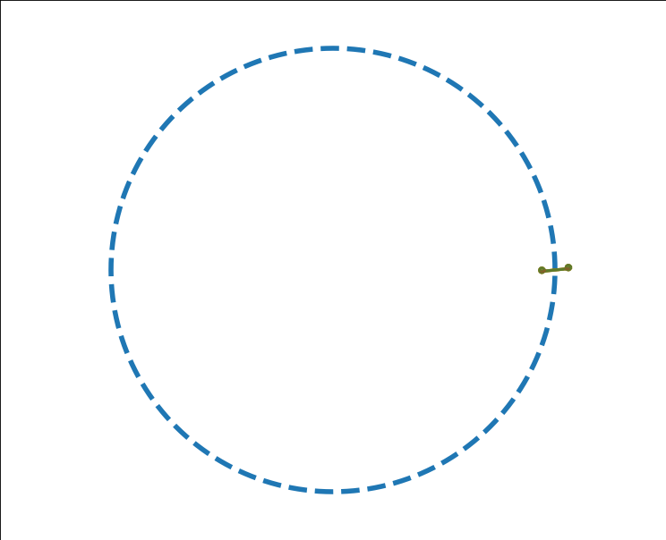
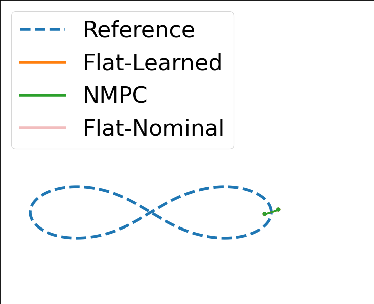

# flat-residual
This repository contains the code needed to reproduce the examples found in

F.Yang, J.Welde and N.Matni, "Learning Flatness-Preserving Residuals for Pure-Feedback Systems"

To run the experiments, install the relevant packages in `requirement.txt` and run the following command in the terminal
```bash
python3 script.py
```
The results will be saved in the `results` folder and can be visualized with the `Plotting.ipynb` notebook.


## Visualization of Simulation Results
1. Open-loop rollout of control input generated by the learned vs. nominal flatness diffeomorphisms.
    <div style="display: flex; justify-content: center; gap: 10px;">
        
        
    </div>

2. Flatness-based controller using learned residual model vs. Nonlinear MPC
    <div style="display: flex; justify-content: center; gap: 10px;">
        
        
    </div>
